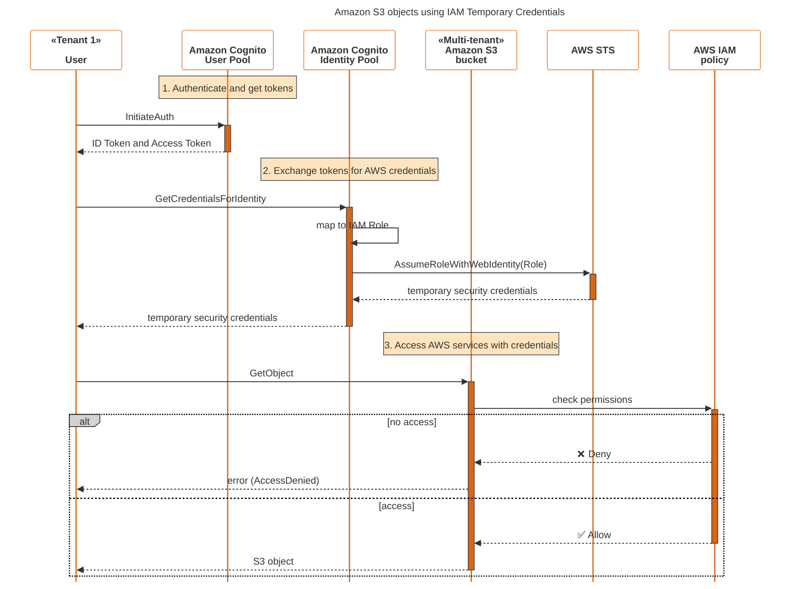

# Submissions for fullstackopen course
[fullstackopen course](https://fullstackopen.com/en/)

```plantumlcode
@startuml
alice->bob:hello
@enduml
```


```mermaid
%%{init: {'sequence': { 'mirrorActors': false, 'rightAngles': true, 'messageAlign': 'center', 'actorFontSize': 20, 'actorFontWeight': 900, 'noteFontSize': 18, 'noteFontWeight': 600, 'messageFontSize': 14}}}%%
%%{init: {'theme': 'base', 'themeVariables': {'labelBoxBkgColor': 'lightgrey', 'labelBoxBorderColor': '#000000', 'actorBorder': '#D86613', 'actorBkg': '#ffffff', 'activationBorderColor': '#232F3E', 'activationBkgColor': '#D86613', 'noteBkgColor': 'rgba(255, 153, 0, .25)', 'noteBorderColor': '#232F3E'}}}%%
sequenceDiagram
    title Amazon S3 objects using IAM Temporary Credentials

    participant user as «Tenant 1»<br /><br />User
    participant userpool as <br />Amazon Cognito<br />User Pool
    participant idpool as <br />Amazon Cognito<br />Identity Pool
    participant s3 as «Multi-tenant»<br />Amazon S3<br />bucket
    participant sts as <br />AWS STS<br />
    participant permissions as <br />AWS IAM<br />policy

    note over userpool: 1. Authenticate and get tokens
    user ->>+ userpool: InitiateAuth
    userpool -->>- user: ID Token and Access Token

    note over idpool: 2. Exchange tokens for AWS credentials
    user ->>+ idpool: GetCredentialsForIdentity
    idpool ->> idpool: map to IAM Role
    idpool ->>+ sts: AssumeRoleWithWebIdentity(Role)
    sts -->>- idpool: temporary security credentials
    idpool -->>- user: temporary security credentials
   
    note over s3: 3. Access AWS services with credentials
    user ->>+ s3: GetObject
    s3 ->>+ permissions: check permissions
    alt no access
      permissions -->> s3: ❌ Deny
      s3 -->> user: error (AccessDenied)
    else access
      permissions -->>- s3: ✅ Allow
      s3 -->>- user: S3 object
    end 
```
</div>